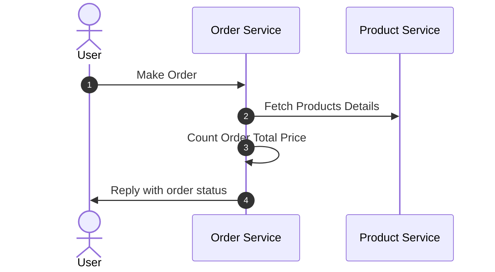

# Getting Started

### In order to build the app

* follow instructions in product-srv first
* then follow instructions in order-srv

### In order to use the app
* start both apps
* execute POST request on order service

### Request Flow


### Order Request example
```
POST http://localhost:8081/v1/orders
Content-Type: application/json

{
    "items": [
        {
            "productId": "35cd851f-2276-4b98-9ed5-a7af4f0811f7",
            "quantity": 1
        },
        {
            "productId": "5c64e76a-0478-4c5c-bf1d-db1124adb787",
            "quantity": 2
        }
    ]
}
```

### Order Response example
```
{
    "id": "f8f0093b-c7d7-417a-9870-f252c6528bc1",
    "status": "SUCCEEDED",
    "createdAt": "2024-07-17T13:50:13.0829552",
    "totalPrice": 5.00
}
```

### Search Products request example
```
POST http://localhost:8080/v1/products:search
Content-Type: application/json

{
    "productIds": [
        "b2a1d7f9-af1a-4b45-9fd0-3f2f8a60a41b",
        "35cd851f-2276-4b98-9ed5-a7af4f0811f7",
        "5c64e76a-0478-4c5c-bf1d-db1124adb787"
    ]
}
```

### Search Products Response example
```
[
    {
        "id": "35cd851f-2276-4b98-9ed5-a7af4f0811f7",
        "name": "Product 1",
        "price": 1.00,
        "quantity": 1
    },
    {
        "id": "5c64e76a-0478-4c5c-bf1d-db1124adb787",
        "name": "Product 2",
        "price": 2.00,
        "quantity": 2
    },
    {
        "id": "b2a1d7f9-af1a-4b45-9fd0-3f2f8a60a41b",
        "name": "Product 4",
        "price": 4.00,
        "quantity": 4
    }
]
```
