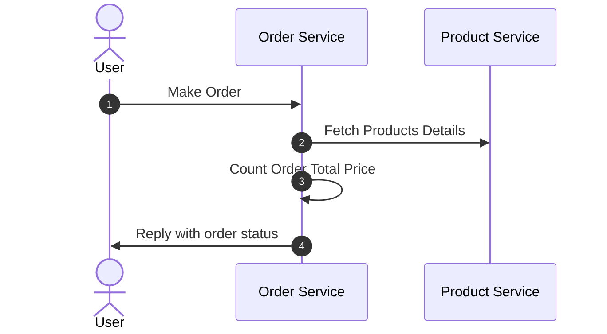

# Getting Started

### In order to build the app

* follow instructions in product-srv first
* then follow instructions in order-srv

### In order to use the app
* start both apps
* execute POST request on order service

### Request example
```
POST http://localhost:8081/v1/orders
Content-Type: application/json

{
  "items": [
    {
      "productId": "35cd851f-2276-4b98-9ed5-a7af4f0811f7",
      "quantity": 1
    },
    {
      "productId": "5c64e76a-0478-4c5c-bf1d-db1124adb787",
      "quantity": 2
    }
  ]
}
```

### Request Flow

```mermaid
sequenceDiagram
    autonumber
    actor u as User
    participant ord as Order Service
    participant prd as Product Service
    u->>ord: Make Order
    ord->>prd: Fetch Products Details
    ord->>ord: Count Order Total Price
    ord->>u: Reply with order status
```
